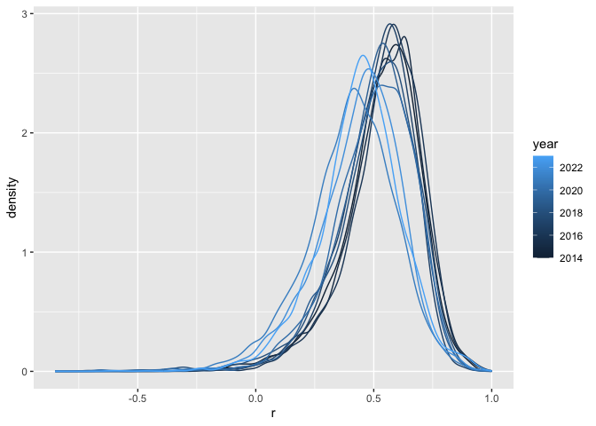
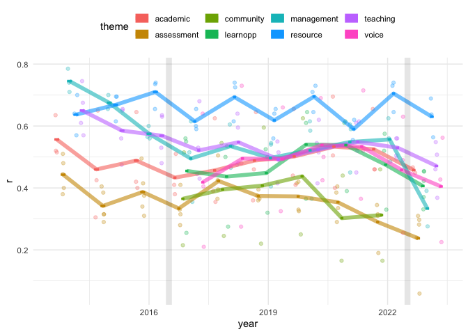

NSS results
================

This is a notebook to analyse NNS data from 2014-2023, baswed on data
from NSS wesbite.

If you don’t have eyethinkdata tools, install from github

``` r
devtools::install_github("dcr-eyethink/eyethinkdata")
```

Load in the package and the raw data. Note that this has been filtered
to just psychology courses, and students on first degree only.

``` r
library(eyethinkdata)
```

    ## Loading required package: ggplot2

    ## Loading required package: data.table

``` r
full_data <- fread("NSS_2014-23.csv")
qkey <-  data.table(read.csv("qkey3.csv"))
```

First we need to translate the question numbers into the items and
labels. There are 3 slightly difference question sets. Annoying. So we
have to merge info from the question keys to three different sections.
For each, we will have columns for the theme, the full question, and a
one word question key q.

``` r
d <- rbind( pid_merge(full_data[year<=2016], qkey[,.(QuestionNumber=qnum,theme=theme2014,q=item2014,question=set_full2014)],link="QuestionNumber"),
 pid_merge(full_data[year>2016 & year<2023], qkey[,.(QuestionNumber=qnum,theme=theme2017,q=item2017, question=set_full2017)],link="QuestionNumber"),
 pid_merge(full_data[year==2023], qkey[,.(QuestionNumber=qnum,theme=theme2023,q=item2023, question=set_full2023)],link="QuestionNumber"))
```

Now we want one number that summarises responses to the question. Right
now we have the distribution of responses for each. All the items are
framed positively, ie if they agree with the statement the student is
saying something good about the university. So we’re going to code into
a response variable between -1 and 1 that is positive if they are
agreeing, and negative if they are disagreeing. This is different to how
the NSS processes this. They have a positivity score, which I assume
just calculates the % of responses that are agreeing in anyway. That
seems to ignore some of the graded information we have in this dataset
tbough.

For pre 2023, each question has 5 columns giving % responses for the 5
options from strongly agree to strongly disagree. Convert these first to
numbers, and then sum to a -1 to 1 scale in a variable r.

``` r
d[year<2023,ans_sd:=ifelse(A1=="",0,as.numeric(gsub(A1,replacement = "",pattern="%")))]
d[year<2023,ans_d:=ifelse(A2=="",0,as.numeric(gsub(A2,replacement = "",pattern="%")))]
d[year<2023,ans_n:=ifelse(A3=="",0,as.numeric(gsub(A3,replacement = "",pattern="%")))]
d[year<2023,ans_a:=ifelse(A4=="",0,as.numeric(gsub(A4,replacement = "",pattern="%")))]
d[year<2023,ans_sa:=ifelse(A5=="",0,as.numeric(gsub(A5,replacement = "",pattern="%")))]
d[year<2023,r:= (ans_sa + ans_a*.5  + ans_d *-.5 + ans_sd*-1)/100]
```

For 2023 onwards, We have total number of responses for 4 options from
strongly agree to strongly disagree, ie there is no ‘neither agree nor
disagree’ option. Convert these to a -1 to 1 scale as above.

``` r
d[year>=2023,ans_sa:=ifelse(A1=="",0,as.numeric(A1))]
d[year>=2023,ans_a:=ifelse(A2=="",0,as.numeric(A2))]
d[year>=2023,ans_d:=ifelse(A3=="",0,as.numeric(A3))]
d[year>=2023,ans_sd:=ifelse(A4=="",0,as.numeric(A4))]
d[year>=2023,r:= (ans_sa + ans_a*.5  + ans_d *-.5 + ans_sd*-1)/(ans_sa+ans_a+ans_d+ans_sd)]
```

I’m going to exclude the questions that aren’t in the main list, and
that are about the student union. Then let’s check the distribution of
those values over all questions for each year.

``` r
d <- d[!theme=="union" & !is.na(theme)]
ggplot(d,aes(x=r,colour=year,group=year))+geom_density()
```

<!-- -->

So it broadly looks as though agreement in these statement overall peaks
around the positive, “agree” response, but that over the years,
responses have been slipping down for everyone.

Now let’s plot UCL’s last 10 years for each theme There are vertical
gray bars here to denote when questionnaire changed, making comparisons
difficult. I am going to exclude the themes for mental_health, personal,
overall satisfaction and freedom as they only have single question each
that were only asked in a handful of years.

``` r
d[,tm:=ifelse(theme %in% c("mental_health", "personal", "freedom","overall"),FALSE,TRUE)]
# this is a plot element with the new questionnaires marked. We can reuse it
yp <-  geom_vline(data=data.table(year=c(2016.5,2022.5)),alpha=0.1,linewidth=3,aes(xintercept=year))
pirateye(d[Institution=="University College London" & tm],x_condition = "year",
         colour_condition = "theme",line = T,dv="r",violin = F,error_bars = F)+yp
```

<!-- -->

So people love our resources! The rankings seem pretty stable over time
here. Rankings seem higher pre 2017 and there is a drop off in 2023, but
as the grey lines show, these changes are confounded by a different set
of questions (and responses). What does seem clear here is that our weak
point is our assessments. These are ranked low and if anything have been
getting worse.

How do we match up with the average psych dept? Here’s all rankings over
the years, comparing UCL against all other psych depts.

``` r
d[,ucl:=ifelse(Institution=="University College London",TRUE,FALSE)]
d[,ucl_all:=ifelse(Institution=="University College London","UCL","All other")]
pirateye(d[ (tm) ],x_condition = "year",colour="ucl_all",dodgewidth = 0,
         line = T,dv="r",violin = F,error_bars = T,dots=F)+yp
```

<!-- -->

So in general terms: we had a relatively great pandemic! At least up
until 2023 (the cohort that were in their first year during pandemic).
But again the picture is complicated by the change in survey. We can
split those responses by theme and compare against other depts. It’s a
bit messy comparing all individual themes for both, so let’s try and
simplify this by using a baseline. We can z score the r values for each
question, each year.

``` r
d[, rzall:=scale(r),by=.(year,question)]
pirateye( d[ucl & tm],x_condition = "year",colour_condition =  "theme",dodgewidth = 0,
         line = T,dv="rzall",violin = F,error_bars = F,dots=F)+yp+geom_hline(aes(yintercept=0))
```

<!-- -->

So now the psychology sector average for each year is 0, shown by heavy
black line. Benchmarked like this, it looks like we had a good period of
growth from 2016 onwards, and in the pandemic years we were well above
the mean in almost everything. But again, our assessments are ranked
below the mean and perhaps trending down
